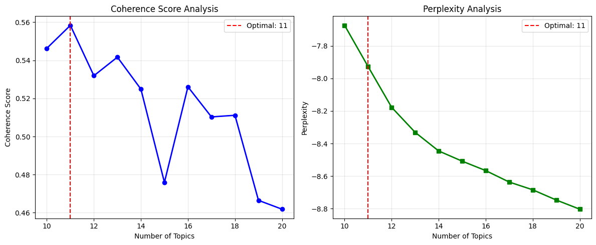

# 📊 Báo cáo: Topic Modeling với Gensim LDA trên Amazon Reviews

## 1. Giới thiệu
Mục tiêu của báo cáo là xây dựng một pipeline **LDA (Latent Dirichlet Allocation)** để trích xuất chủ đề từ dữ liệu **Amazon Reviews**.  
Các bước chính:
1. Tải và chuẩn bị dữ liệu.
2. Tiền xử lý văn bản (cleaning, tokenization, stopwords, lemmatizer).
3. Tạo bigram/trigram.
4. Xây dựng dictionary và corpus cho Gensim.
5. Huấn luyện mô hình LDA, tìm số lượng topic tối ưu.
6. Đánh giá bằng **Coherence Score** và **Perplexity**.
7. Kiểm thử trên tập test.

---

## 2. Dữ liệu
- Dataset: [`kritanjalijain/amazon-reviews`](https://www.kaggle.com/datasets/kritanjalijain/amazon-reviews) (tải qua `kagglehub`).
- Cấu trúc dữ liệu gốc: `label`, `title`, `text`.
- Sau khi xử lý:
  - Kết hợp `title + text` → `input`.
  - Sinh thêm cột `lda_input` chứa tokens sau preprocessing.

**Cấu hình dữ liệu:**
```python
CONFIG = {
    "train_size": 100000,
    "test_size": 10000
}
```

---

## 3. Tiền xử lý dữ liệu

### 3.1. Làm sạch dữ liệu (`PreProcessor`)
- Loại bỏ **URL, email, HTML tag, entities**.
- Loại bỏ **@mentions, #hashtags**.
- Xóa số, ký tự đặc biệt, ký tự lặp quá nhiều.
- Chuẩn hóa khoảng trắng.
- Loại bỏ từ 1 ký tự (trừ các từ ngắn có nghĩa như *a, i, we, he,...*).

### 3.2. Tokenization & Stopwords
- Tách từ bằng `nltk.word_tokenize`.
- Stopwords sử dụng từ `stopwords_config.py` (dựa trên NLTK + mở rộng).

### 3.3. Chuẩn hóa từ
- Với **PreProcessor**: dùng Snowball Stemmer (stemming).  
- Với **LDA pipeline**: thay thế bằng **WordNet Lemmatizer** để giữ nguyên ngữ nghĩa hơn.

### 3.4. Output
- Kết quả mỗi văn bản là một list token đã sạch (`lda_input`).

---

## 4. Xử lý n-grams
Pipeline dùng `gensim.models.Phrases` để phát hiện **cụm từ nhiều từ** (bigrams/trigrams).  
  ```python
  bigram = Phrases(texts, min_count=5, threshold=50)
  trigram = Phrases(bigram[texts], threshold=50)
  ```
- **`min_count=5`**: một cụm từ phải xuất hiện ít nhất 5 lần mới được xét là bigram/trigram.  
  → Giúp loại bỏ các cụm quá hiếm.  

- **`threshold=50`**: ngưỡng đánh giá độ mạnh của cụm từ.  
  → Giá trị cao giữ lại cụm từ thực sự phổ biến (*credit_card*), giá trị thấp sẽ tạo nhiều cụm nhưng dễ nhiễu.  

**Ví dụ:**  
- `"credit card"` → `"credit_card"`  
- `"new york city"` → `"new_york_city"`

Ý nghĩa: giúp mô hình LDA giữ nguyên các cụm từ quan trọng thay vì tách rời, từ đó chủ đề sinh ra có ngữ nghĩa rõ hơn.  

---

## 5. Dictionary và Corpus
- Tạo dictionary từ toàn bộ tokens.  
- Lọc từ hiếm và từ quá phổ biến:
  ```python
  dictionary.filter_extremes(
      no_below=10,      # từ xuất hiện < 10 docs bị loại
      no_above=0.5,    # từ xuất hiện > 50% docs bị loại
      keep_n=10000     # giữ tối đa 10000 từ
  )

  ```
**Ý nghĩa tham số:**

- no_below=10 → loại bỏ từ quá hiếm (ít hơn 10 văn bản có).
- no_above=0.5 → loại bỏ từ quá phổ biến (xuất hiện trong hơn 50% văn bản).
- keep_n=10000 → giữ lại nhiều nhất 10,000 từ quan trọng nhất sau khi lọc.

**Ví dụ:**
- Từ "battery" có trong 5 văn bản → bị loại (quá hiếm).
- Từ "product" có trong 80% văn bản → bị loại (quá phổ biến).
- Từ "camera" có trong 200 văn bản → được giữ lại.

👉 Mục đích: giảm nhiễu, loại bỏ từ ít giá trị, giữ lại bộ từ vựng “vừa đủ” để mô hình LDA học chủ đề rõ ràng hơn.
- Tạo **corpus** dưới dạng bag-of-words.

---

## 6. Huấn luyện LDA
### 6.1. Tham số huấn luyện
```python
LdaModel(
    corpus=corpus,
    id2word=dictionary,
    num_topics=num_topics,       # số topic (tìm tối ưu trong khoảng 10-20)
    passes=10,                   # số lần duyệt corpus
    iterations=100,              # số vòng lặp tối đa
    alpha='auto',                # Dirichlet prior cho topic distribution
    eta='auto',                  # Dirichlet prior cho word distribution
    random_state=42,
    per_word_topics=True
)
```

### 6.2. Tìm số lượng topics tối ưu
Việc chọn số lượng chủ đề là một bước quan trọng trong mô hình hóa LDA. Một số lượng chủ đề quá ít có thể làm cho các chủ đề quá rộng và khó hiểu, trong khi quá nhiều chủ đề có thể dẫn đến các chủ đề trùng lặp hoặc quá cụ thể. Chúng tôi đã sử dụng các chỉ số đánh giá để tìm ra K tối ưu.

- **Cách thức thực hiện:**
  1. **Huấn luyện nhiều mô hình:** Chúng tôi đã huấn luyện các mô hình LDA với số lượng chủ đề khác nhau, trong phạm vi từ 10 đến 20.
  2. **Đánh giá bằng Coherence và Perplexity:** Đối với mỗi mô hình, chúng tôi tính toán hai chỉ số chính:
     - **Coherence Score (Chỉ số mạch lạc):** Đo lường mức độ liên quan ngữ nghĩa giữa các từ hàng đầu trong một chủ đề. Chỉ số coherence cao (gần 1) cho thấy các từ trong chủ đề có xu hướng xuất hiện cùng nhau trong các tài liệu, tạo nên các chủ đề dễ hiểu và có ý nghĩa. Chúng tôi sử dụng chỉ số `c_v` coherence.
     - **Perplexity (Độ khó hiểu):** Đo lường mức độ tốt của mô hình trong việc dự đoán các tài liệu mới.

- **Kết quả đánh giá:** Bảng dưới đây hiển thị kết quả Coherence và Perplexity cho từng số lượng chủ đề được thử nghiệm:

  | Number of Topics | Coherence Score | Perplexity Score |
  |------------------|-----------------|------------------|
  | 10               | 0.5463          | -7.6744          |
  | 11               | 0.5584          | -7.9276          |
  | 12               | 0.5319          | -8.1773          |
  | 13               | 0.5417          | -8.3309          |
  | 14               | 0.5249          | -8.4453          |
  | 15               | 0.4759          | -8.5080          |
  | 16               | 0.5261          | -8.5658          |
  | 17               | 0.5103          | -8.6361          |
  | 18               | 0.5111          | -8.6837          |
  | 19               | 0.4665          | -8.7464          |
  | 20               | 0.4618          | -8.8027          |

  

- **Lựa chọn số lượng chủ đề tối ưu:** Dựa trên kết quả, số lượng chủ đề **11** mang lại điểm Coherence cao nhất là **0.5584**. Mặc dù Perplexity có xu hướng giảm khi số lượng chủ đề tăng lên (điều này thường xảy ra), chỉ số Coherence thường được ưu tiên hơn khi đánh giá tính dễ hiểu của các chủ đề đối với con người. Do đó, **11 chủ đề** được chọn làm số lượng chủ đề tối ưu cho mô hình LDA cuối cùng.

### 6.3 Kết quả đánh giá mô hình LDA cuối cùng

Sau khi xác định số lượng chủ đề tối ưu là 11, mô hình LDA cuối cùng đã được huấn luyện và đánh giá:

- **Số lượng chủ đề:** 11
- **Điểm Coherence (Tập huấn luyện):** 0.5584
- **Perplexity (Tập huấn luyện):** -7.9276 - Chỉ số này cho thấy mô hình phù hợp với dữ liệu huấn luyện như thế nào.
- **Kích thước từ điển:** 10000
- **Kích thước Corpus:** 99995

**Các chủ đề được khám phá**
Dưới đây là danh sách 11 chủ đề được mô hình LDA khám phá, cùng với 10 từ khóa hàng đầu có trọng số cao nhất trong mỗi chủ đề. Các từ khóa này giúp chúng ta diễn giải ý nghĩa của từng chủ đề:

- **Chủ đề 0:** story, character, life, novel, child, world, reader, man, woman, family (Chủ đề liên quan đến văn học, truyện kể và các yếu tố con người/gia đình.)
- **Chủ đề 1:** dog, water, hot, hair, taste, grip, concert, smell, air, heat (Chủ đề có thể liên quan đến các trải nghiệm cảm giác, vật nuôi hoặc các yếu tố môi trường.)
- **Chủ đề 2:** use, nice, easy, small, case, look, fit, camera, well, side (Chủ đề liên quan đến việc sử dụng sản phẩm, đặc điểm vật lý (kích thước, sự vừa vặn) và các thiết bị như máy ảnh.)
- **Chủ đề 3:** great, one, love, best, ever, every, must, classic, year, still (Chủ đề biểu thị sự yêu thích, đánh giá tích cực và các sản phẩm/trải nghiệm được coi là "kinh điển" hoặc "tốt nhất".)
- **Chủ đề 4:** book, good, like, read, one, would, get, really, time, dont (Chủ đề chung về sách và trải nghiệm đọc, bao gồm cả ý kiến cá nhân.)
- **Chủ đề 5:** game, play, player, computer, drive, system, card, kelly, waste_money, graphic (Chủ đề rõ ràng về trò chơi điện tử, phần cứng máy tính (card, drive, system) và các yếu tố liên quan.)
- **Chủ đề 6:** work, product, buy, bought, one, used, would, back, problem, got (Chủ đề liên quan đến việc mua sắm, sử dụng sản phẩm và các vấn đề/kinh nghiệm sau khi mua.)
- **Chủ đề 7:** book, help, information, learn, example, simple, class, need, basic, excellent (Chủ đề về sách mang tính hướng dẫn, giáo dục, cung cấp thông tin và sự giúp đỡ.)
- **Chủ đề 8:** version, quality, original, picture, poor, copy, letter, color, edition, available (Chủ đề liên quan đến chất lượng, các phiên bản (gốc/sao chép), hình ảnh và các đặc điểm vật lý khác của sản phẩm.)
- **Chủ đề 9:** movie, film, dvd, bad, watch, video, see, worst, funny, show (Chủ đề tập trung vào phim ảnh, DVD và trải nghiệm xem, bao gồm cả đánh giá tích cực/tiêu cực.)
- **Chủ đề 10:** album, song, music, sound, band, track, heard, listen, voice, rock (Chủ đề rõ ràng về âm nhạc, album, bài hát, ban nhạc và các thể loại (rock).)


---

## 8. Trực quan hóa
Để trực quan hóa và hiểu rõ hơn về các chủ đề được phát hiện, chúng tôi sử dụng các công cụ sau:

- **pyLDAvis:** Một công cụ tương tác mạnh mẽ giúp trực quan hóa phân bố các chủ đề, mối quan hệ giữa chúng và sự phân bố của các từ trong từng chủ đề.

- **WordCloud:** Tạo mây từ cho từng topic, hiển thị trực quan các từ khóa quan trọng nhất trong mỗi chủ đề với kích thước tương ứng với trọng số của chúng.

- **Bar chart**: Biểu đồ thanh hiển thị top N từ khóa có trọng số cao nhất trong từng chủ đề, giúp so sánh và nhận diện các từ đặc trưng của mỗi chủ đề.

(Lưu ý: Để giữ cho báo cáo ngắn gọn, các hình ảnh trực quan hóa sẽ được cung cấp riêng hoặc hiển thị trong công cụ tương tác.)

## 9. Kết luận
Báo cáo này đã trình bày quy trình phân tích chủ đề trên tập dữ liệu Amazon Reviews bằng cách sử dụng mô hình LDA của thư viện Gensim. Qua quá trình tiền xử lý dữ liệu kỹ lưỡng và tìm kiếm số lượng chủ đề tối ưu dựa trên chỉ số Coherence và Perplexity, chúng tôi đã xác định được 11 chủ đề chính trong tập dữ liệu. Mỗi chủ đề được đặc trưng bởi một tập hợp các từ khóa hàng đầu, giúp chúng ta hiểu rõ hơn về nội dung và các khía cạnh khác nhau được thảo luận trong các bài đánh giá sản phẩm trên Amazon. Kết quả đánh giá trên tập kiểm tra cho thấy mô hình có khả năng phân loại tài liệu vào các chủ đề một cách tương đối hiệu quả.

**Các hướng cải thiện tiềm năng:**

Mặc dù mô hình đã cho kết quả ban đầu tốt, vẫn có một số hướng có thể cải thiện để nâng cao chất lượng và độ chính xác của mô hình hóa chủ đề:

- **Thử nghiệm với các số lượng chủ đề khác nhau:** Mở rộng phạm vi tìm kiếm số lượng chủ đề tối ưu ngoài khoảng 10-20 có thể giúp khám phá ra số lượng chủ đề phù hợp hơn nữa.
- **Điều chỉnh siêu tham số của mô hình LDA:** Các siêu tham số như alpha (prior document topic distribution) và beta (prior topic word distribution) có thể ảnh hưởng đáng kể đến kết quả mô hình. Việc tinh chỉnh các tham số này có thể cải thiện chất lượng chủ đề.
- **Nâng cao quy trình tiền xử lý văn bản:** Khám phá các kỹ thuật tiền xử lý nâng cao hơn như xử lý từ đồng nghĩa, nhận dạng thực thể có tên (NER) hoặc sử dụng các phương pháp chuẩn hóa khác có thể giúp tạo ra các token chất lượng cao hơn cho mô hình.
- **Sử dụng các chỉ số đánh giá chủ đề khác:** Ngoài Coherence và Perplexity, có các chỉ số khác như Silhouette score hoặc đánh giá thủ công (human evaluation) có thể cung cấp cái nhìn bổ sung về chất lượng chủ đề.
- **Khám phá các mô hình chủ đề khác:** Ngoài LDA, có các mô hình chủ đề khác như NMF (Non-negative Matrix Factorization) hoặc Top2Vec có thể phù hợp hơn với đặc điểm của dữ liệu này.
- **Phân tích chuyên sâu từng chủ đề:** Sau khi xác định chủ đề, việc phân tích sâu hơn các tài liệu thuộc về từng chủ đề cụ thể có thể giúp hiểu rõ hơn về nội dung và sắc thái của chủ đề đó.
